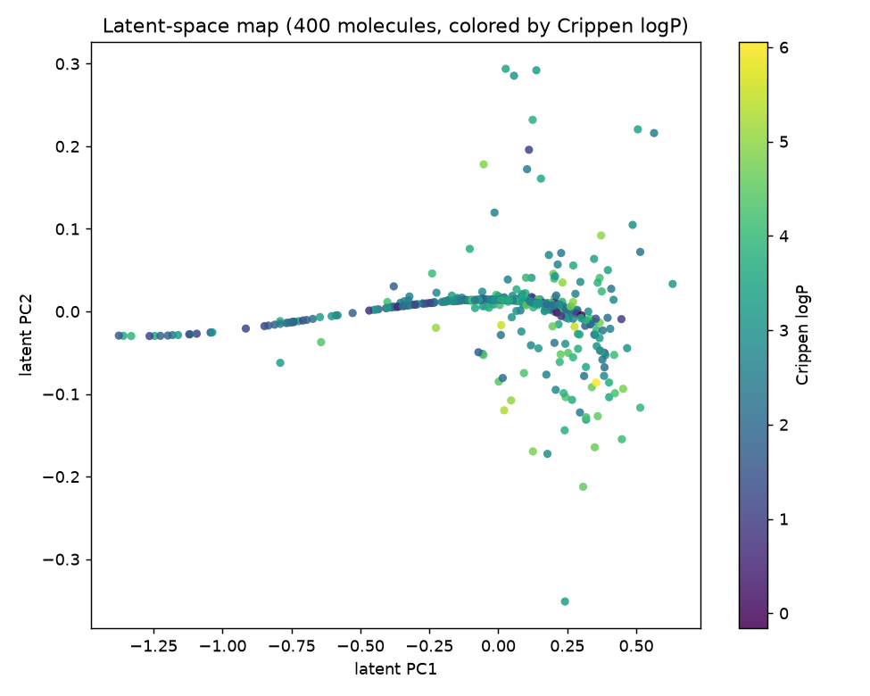

# Molecular generative models: a small SMILES VAE

*Origin: Originally developed for the AI Chemistry course at KAIST (Fall 2022); refactored and open-sourced in July 2026.*

A short, honest study of one question, with the code, data sample, and pretrained
model to reproduce it.

## Question

Can a small character-level GRU variational autoencoder, trained briefly on a few
hundred molecules on a CPU, generate valid SMILES strings, and does its latent
space organize molecules by chemistry?

The interesting part of that question is the word "small". Large SMILES VAEs reach
high validity, but they are large and trained for a long time. This project asks
what a deliberately tiny model gets you, and reports the modest answer plainly
rather than dressing it up.

## Method

- **Representation**: molecules as SMILES strings, tokenized per character with
  the two-letter atoms `Cl` and `Br` kept whole (`src/molgen/tokenizer.py`).
- **Model**: a GRU encoder maps a string to a Gaussian posterior, the
  reparameterization trick samples a latent code, and a GRU decoder generates
  characters autoregressively (`src/molgen/models.py`). Embedding 48, hidden 128,
  latent 32, about 0.15 M parameters.
- **Objective**: the evidence lower bound, reconstruction cross entropy plus a KL
  term to a standard Gaussian prior. The full derivation is in
  [docs/method.md](docs/method.md).
- **Training**: 80 epochs on 400 molecules, Adam, KL annealing to a small target
  weight to fight posterior collapse. Word dropout is implemented and tested as a
  second collapse remedy; the method note explains the trade-off and why the
  committed checkpoint does not use it.
- **Evaluation**: sample 1000 molecules from the prior and score validity,
  uniqueness, and novelty with RDKit. Without RDKit the code falls back to a
  syntactic grammar check and says so.

The data is 400 canonical SMILES carved from the public MoleculeNet Lipophilicity
set, labels dropped, filtered to a learnable length. It is committed at
`data/sample_smiles.txt`; see [data/README.md](data/README.md).

## Findings

Measured this session with RDKit 2026.03.3, seed 0, and stored in
`results/metrics.json`:

| Metric | Value |
|--------|------:|
| Validity | 0.150 |
| Uniqueness | 0.980 |
| Novelty | 1.000 |
| Final reconstruction loss | 0.79 |
| Final KL | 0.065 |

The honest headline is that validity is low. About one sampled string in seven
parses as a real molecule. That is what a 0.15 M parameter character model trained
for 80 epochs on 400 molecules on a CPU produces. The valid samples are drug-like
and almost entirely novel, so the model has learned real SMILES structure, but it
has not learned to keep every ring closed and every branch balanced. Uniqueness
and novelty are near their ceilings, which only matters because it rules out
memorization; on their own those two numbers are easy and should not be read as
success.

### Hero artifact: the latent-space map



Each point is one training molecule placed at the PCA projection of its latent
mean, colored by Crippen logP. The map is the visual answer to the second half of
the question. The latent is lightly used rather than collapsed (final KL 0.065),
and its first principal component tracks molecular size, with logP following more
weakly. The organization is partial, not clean disentanglement, and the figure is
shown at that honest resolution. Regenerate it, the metrics, and the checkpoint
with `python scripts/build_artifacts.py`.

## Reproduce

Install into a fresh environment:

```bash
python -m venv .venv && source .venv/bin/activate   # Windows: .venv\Scripts\activate
pip install torch --index-url https://download.pytorch.org/whl/cpu
pip install -e ".[dev]"
pip install rdkit          # optional; enables real validity checking
```

Sample from the committed pretrained VAE, fully offline, no training:

```bash
python scripts/sample.py --n 20
```

Retrain end to end on the committed sample and rebuild every artifact (about 40
seconds on a CPU):

```bash
python scripts/build_artifacts.py --data data/sample_smiles.txt --epochs 80
```

Fetch the full corpus and recarve the sample (needs a network):

```bash
python scripts/download_data.py --outdir data
python scripts/make_sample.py --n 400
```

The narrated walkthrough is `notebooks/demo.ipynb`, which is the intended entry
point and is committed already executed.

## Limitations

- Validity is modest and is not enforced during decoding. No grammar mask, valence
  check, or reinforcement signal.
- Generation is unconditional. There is no property targeting.
- The latent organization is real but partial, and is described that way.
- Trained on 400 molecules on a CPU. This is a study and a portfolio piece, not a
  production generator. See [model_card.md](model_card.md) for the full account.

## Repository layout

```
src/molgen/     tokenizer, data, models (AE and VAE), train, metrics, grammar,
                latent (the latent-space map), checkpoint (save/load)
scripts/        sample.py (offline demo), build_artifacts.py, make_sample.py,
                download_data.py, train.py
notebooks/      demo.ipynb (executed)
docs/           method.md (ELBO derivation, KL annealing, word dropout)
models/         vae.pt (committed pretrained checkpoint, about 0.6 MB)
results/        latent_space_map.png, vae_losses.png, metrics.json, samples
data/           sample_smiles.txt committed; full corpus gitignored
tests/          pytest suite
model_card.md   honest metrics and limitations
```

## License

MIT, see [LICENSE](LICENSE).

## Author

Aamir Malik. [GitHub](https://github.com/aamirmalik-dr) ·
[LinkedIn](https://linkedin.com/in/dr-aamirmalik)
